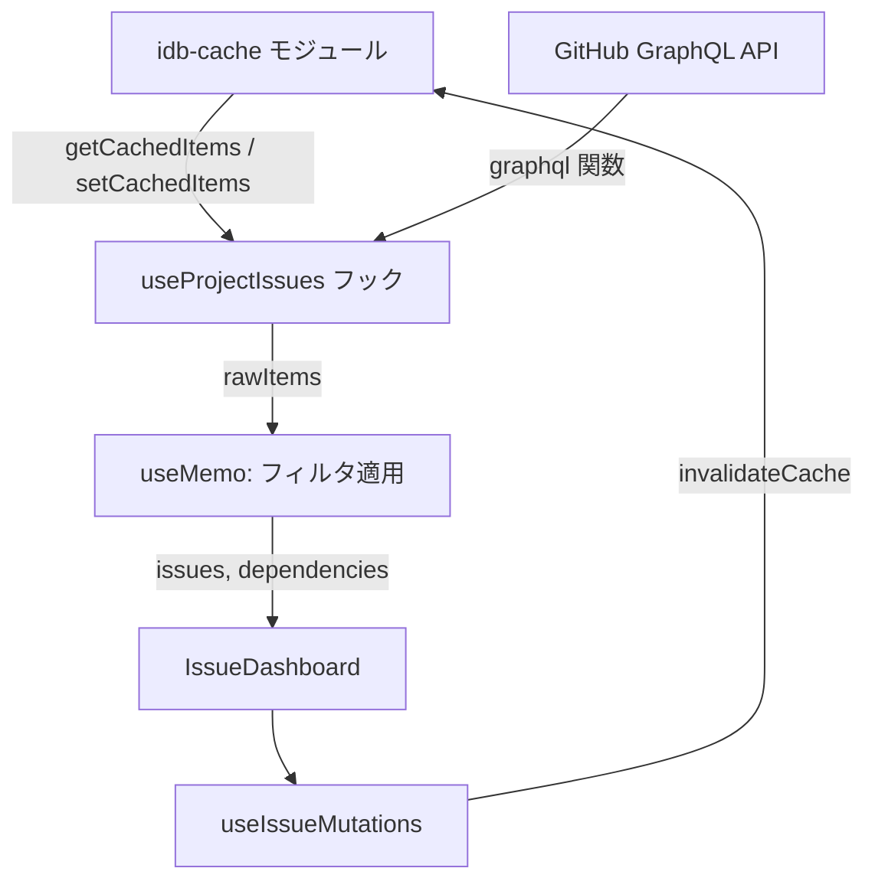
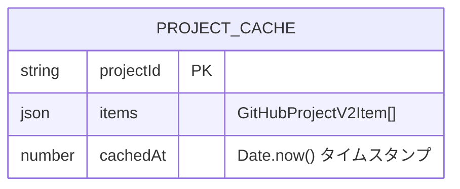
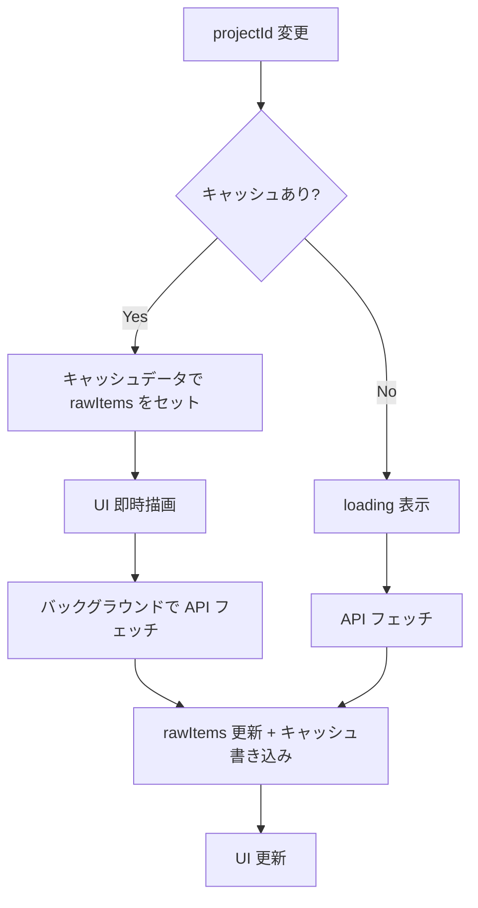
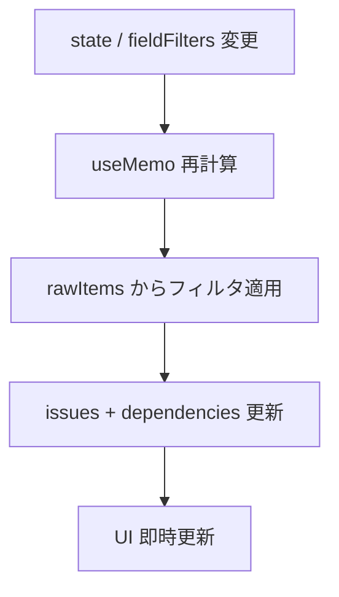
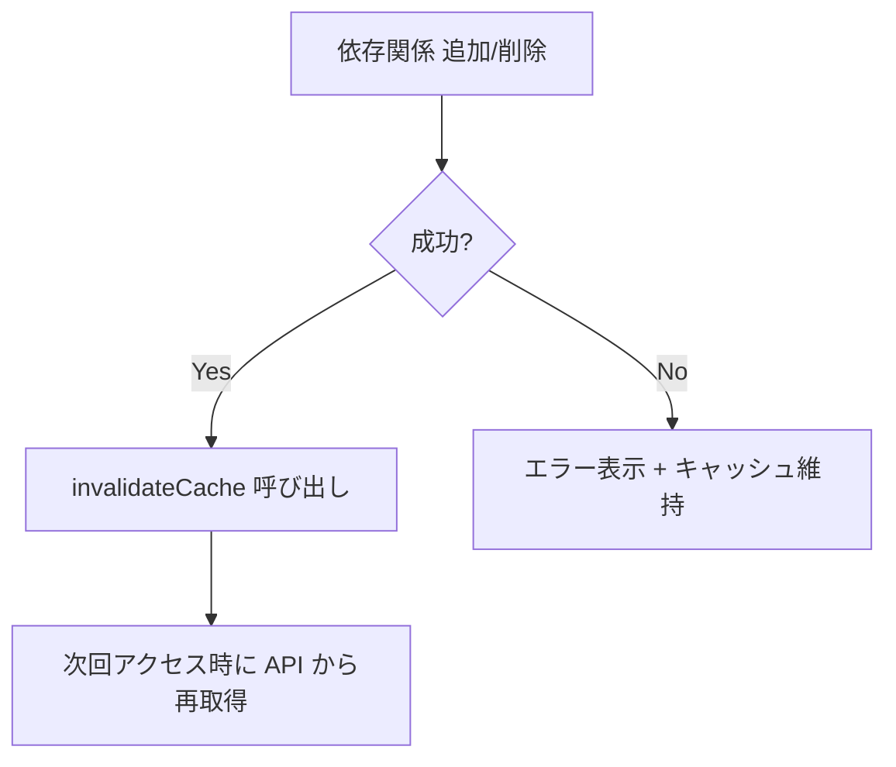

# Design Document

## Overview

このドキュメントは `2026-02-12` に作成されました(`83cae28`)。

ブラウザの IndexedDB にプロジェクトの issue データをキャッシュし、Stale-While-Revalidate (SWR) パターンで即時表示とバックグラウンド更新を実現する。現在の `useProjectIssues` フックが担っている「API フェッチ」と「フィルタリング」を分離し、フィルタ変更時は API を呼ばずにキャッシュ済みデータから即座に再計算する。

## ステアリングドキュメントとの整合性

### tech.md との技術基準

- フロントエンドは React + TypeScript + Vite の既存スタックに従う
- テストは Vitest を使用
- コード品質は Biome でチェック
- 新規依存は `idb`（IndexedDB の Promise ラッパー、~1.2KB gzip）と `fake-indexeddb`（テスト用、devDependency）のみ

### structure.md とのプロジェクト構成

- 新規ファイルは `web/src/lib/` に配置（React 非依存のユーティリティ層）
- ファイル名は kebab-case（`idb-cache.ts`）
- テストファイルは同ディレクトリに `*.test.ts`
- 既存フック・コンポーネントの修正は最小限に留める

## アーキテクチャ

キャッシュ層（`idb-cache`）を新設し、既存のフェッチフック（`useProjectIssues`）に SWR パターンを組み込む。フィルタリングは API フェッチから切り離し、キャッシュ済みデータからの導出に変更する。

### 設計原則

- **単一責任原則**: キャッシュ操作は `idb-cache` モジュールに閉じ込め、フックはデータフロー制御に専念する
- **コンポーネントの分離**: キャッシュ層は React に依存しないスタンドアロンモジュールとして実装する
- **サービス層の分離**: IndexedDB アクセス（`idb-cache`）、データ取得ロジック（`useProjectIssues`）、UI 表示（`IssueDashboard`）を分離する

## データモデリング

### ProjectCache

IndexedDB の `projectItems` ストアに保存されるエントリ。`projectId` をキーとし、API から取得した全 issue の raw データ（`GitHubProjectV2Item[]`）とキャッシュ時刻を保持する。

## エラーハンドリング

### エラーシナリオ

1. **IndexedDB が利用できない（プライベートブラウジング等）:**
   - キャッシュなしの従来動作にフォールバック。ユーザーへの通知なし
   - `getCachedItems` は null を返し、`setCachedItems` は no-op

2. **キャッシュデータの破損:**
   - 一度だけ loading が表示されるが、API フェッチで自動回復
   - 読み取りエラー時は null を返し、次回の API フェッチで正常データが上書きされる

3. **バックグラウンド API フェッチの失敗:**
   - キャッシュデータがそのまま表示され続ける。手動リフレッシュで再試行可能
   - キャッシュ表示済みの場合はエラーを静かに無視する

## テスト戦略

### ユニットテスト

- **対象**: `idb-cache` モジュール（`web/src/lib/idb-cache.test.ts`）
- **主なケース**: get/set ラウンドトリップ、存在しないキーで null、`invalidateCache` / `clearAllCache` の動作、エラー時に例外が投げられない
- **ツール**: Vitest + `fake-indexeddb`

### 結合テスト

- **対象**: `useProjectIssues` フックのキャッシュ統合
- **主なケース**: フィルタ変更時に API リクエストが飛ばない、再アクセス時にキャッシュヒット、refetch で強制再取得、mutation 後のキャッシュ無効化
- **ツール**: Vitest + MSW（既存セットアップ）

### E2Eテスト

- 手動確認: DevTools Network タブでリクエスト数を確認、シークレットウィンドウでのフォールバック動作

## 処理フロー

### プロジェクト選択時（SWR フロー）

### フィルタ変更時

### Mutation 後のキャッシュ無効化

## トレードオフと代替案

| 選択 | 代替案 | 選択理由 |
|------|--------|---------|
| IndexedDB | localStorage | localStorage は 5MB 制限があり、大規模プロジェクトの JSON データには不足する可能性がある。IndexedDB は容量制限が緩く、非同期 API でメインスレッドをブロックしない |
| SWR パターン | TTL ベースのキャッシュ | TTL のみだと「期限内はキャッシュ、期限切れは loading → API」となり、常に最新データに近い状態を保てない。SWR なら即時表示と裏での更新を両立できる |
| `idb` ライブラリ | 素の IndexedDB API | IndexedDB の素の API はコールバックベースで冗長。`idb` は ~1.2KB gzip で Promise ラッパーを提供し、コードの可読性を大幅に改善する |
| キャッシュ無効化（削除） | キャッシュのインプレース更新 | Mutation レスポンスには完全な `GitHubProjectV2Item` が含まれないため、インプレース更新は困難。削除 + 次回再取得がシンプルかつ確実 |

## その他考慮事項

### サーバー起動ポートの固定

IndexedDB は Same-Origin Policy（scheme + host + port）でデータが分離される。現状の Go サーバーは起動のたびにポートが変わるため、前回セッションのキャッシュが別 origin 扱いとなり再利用できない。キャッシュ機能の効果を最大限発揮するため、デフォルトポートを `7000` に固定し、使用中の場合は `7001`, `7002`, ... と順に探す仕様に変更する。
