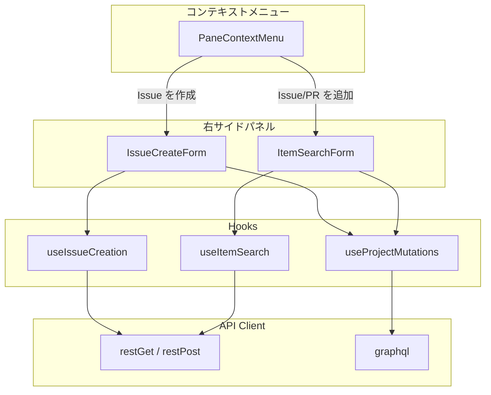
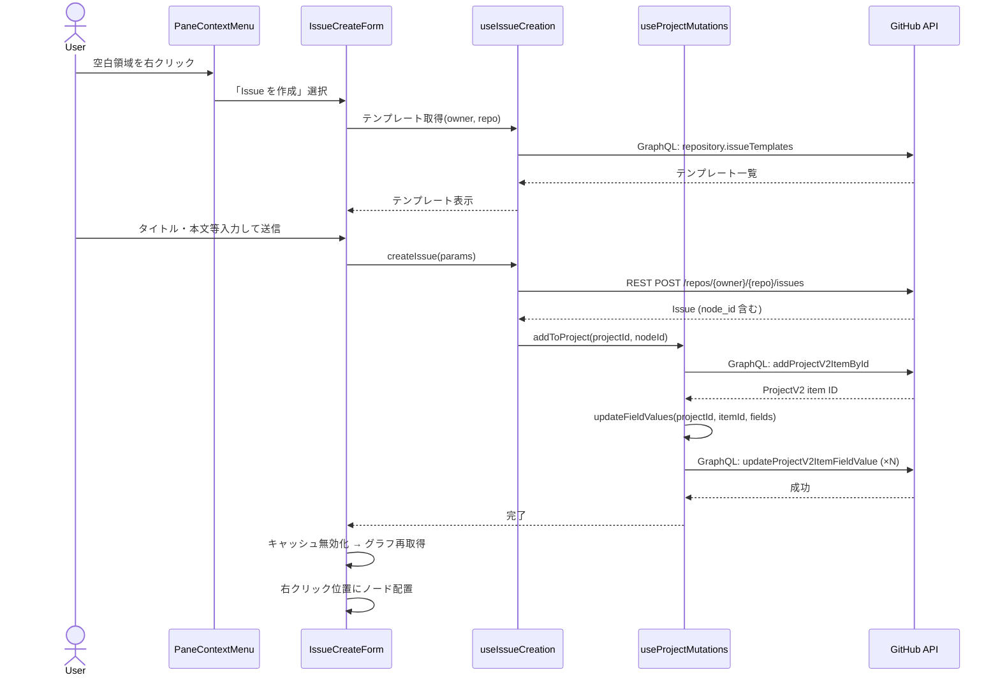
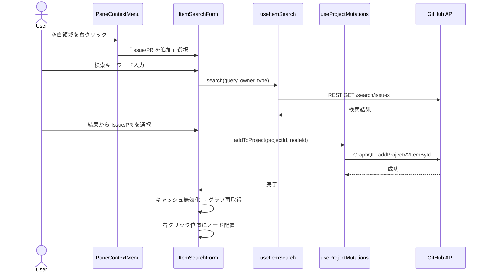

# Design Document

## Overview

このドキュメントは `2026-02-20` に作成されました(`747e4d4`)。

グラフの空白領域を右クリックしてコンテキストメニューからプロジェクトにアイテムを追加する機能の設計。Issue の新規作成（テンプレート対応）、既存 Issue/PR の検索・追加をサポートする。

## ステアリングドキュメントとの整合性

### tech.md との技術基準

- フロントエンドは既存の React + TypeScript パターンに従う
- **MUI (Material UI)** を導入し、複雑なフォーム要素（Autocomplete、Select、TextField 等）に使用する
  - 現在はプレーンな React + インラインスタイルだが、コンボボックス・インクリメンタルサーチ・マルチセレクト等の複雑な UI を自前で実装するコストを回避するため導入
  - MUI コンポーネントは今回の新規フォームでのみ使用し、既存コンポーネントへの影響は最小限に留める
- API 呼び出しは既存の `api-client` の `restGet`/`restPost`/`graphql` を使用
- Issue 作成は REST API、プロジェクトへの追加・フィールド更新は GraphQL API を使用（既存の mutation パターンに準拠）
- テストは Vitest + Storybook + Playwright の既存スタックを使用

### structure.md とのプロジェクト構成

- 新規コンポーネントは `web/src/components/` 配下にケバブケースで作成
- 新規 hook は `web/src/hooks/` 配下に作成
- ファイルサイズ 300 行以下、関数 50 行以下のガイドラインに従う

## アーキテクチャ



### 設計原則

- **単一責任原則**: Issue 作成ロジック、検索ロジック、プロジェクト操作ロジックをそれぞれ独立した hook に分離
- **コンポーネントの分離**: コンテキストメニュー、作成フォーム、検索フォームをそれぞれ独立したコンポーネントとして実装
- **サービス層の分離**: API 呼び出しは hook に集約し、コンポーネントは表示に専念
- **ユーティリティのモジュール化**: 既存の `api-client` を再利用

## データモデリング

### 新規型定義

```typescript
// Issue テンプレート
interface IssueTemplate {
  name: string;
  body: string;
}

// Issue 作成パラメータ
interface CreateIssueParams {
  owner: string;
  repo: string;
  title: string;
  body?: string;
  assignees?: string[];
}

// プロジェクトフィールド値の設定パラメータ
interface ProjectFieldUpdate {
  fieldId: string;
  value: { singleSelectOptionId: string } | { iterationId: string };
}

// 検索結果
interface SearchResult {
  number: number;
  title: string;
  state: "open" | "closed";
  owner: string;
  repo: string;
  nodeId: string;
  isPullRequest: boolean;
}

// コンテキストメニューの状態
interface PaneContextMenuState {
  x: number;         // クライアント座標（メニュー表示位置）
  y: number;
  flowX: number;     // React Flow 座標（ノード配置位置）
  flowY: number;
}
```

## API 設計

### Issue 作成

**REST POST** `/repos/{owner}/{repo}/issues`
```json
{
  "title": "Issue title",
  "body": "Issue description",
  "assignees": ["user1", "user2"]
}
```
レスポンスから `node_id` を取得し、プロジェクトへの追加に使用する。

### Issue テンプレート取得

**GraphQL**
```graphql
query GetIssueTemplates($owner: String!, $name: String!) {
  repository(owner: $owner, name: $name) {
    issueTemplates {
      name
      title
      body
      about
    }
  }
}
```

- GitHub の Issue テンプレートは `.md`（Markdown テンプレート）と `.yml`（Issue Forms）の2種類が存在する
- GraphQL `issueTemplates` は両方を返す
- テンプレート選択時、`title` をタイトル欄に、`body` を本文欄にプリフィルする
- YAML Issue Forms の場合も `body` をそのままテキストエリアに表示する（フォーム構造の再現は行わない）

### プロジェクトにアイテム追加

**GraphQL**
```graphql
mutation AddProjectItem($projectId: ID!, $contentId: ID!) {
  addProjectV2ItemById(input: {
    projectId: $projectId
    contentId: $contentId
  }) {
    item {
      id
    }
  }
}
```

### プロジェクトフィールド値更新

**GraphQL**
```graphql
mutation UpdateFieldValue($projectId: ID!, $itemId: ID!, $fieldId: ID!, $value: ProjectV2FieldValue!) {
  updateProjectV2ItemFieldValue(input: {
    projectId: $projectId
    itemId: $itemId
    fieldId: $fieldId
    value: $value
  }) {
    projectV2Item { id }
  }
}
```

### Issue/PR 検索

**REST GET** `/search/issues?q={query}+user:{owner}+type:{issue|pr}`

### リポジトリコラボレーター取得

**REST GET** `/repos/{owner}/{repo}/collaborators`

## MUI コンポーネントの使用箇所

| UI 要素 | MUI コンポーネント | 用途 |
|---------|-------------------|------|
| リポジトリ選択 | `Autocomplete` + `TextField` | ドロップダウン + freeSolo で手動入力対応 |
| テンプレート選択 | `Select` + `MenuItem` | テンプレート一覧から選択 |
| タイトル入力 | `TextField` | 必須テキスト入力 |
| 本文入力 | `TextField` (multiline) | 任意テキストエリア |
| Assignees 選択 | `Autocomplete` (multiple) | コラボレーターからマルチセレクト + 検索 |
| プロジェクトフィールド | `Select` + `MenuItem` | SINGLE_SELECT / ITERATION フィールドの値選択 |
| Issue/PR 検索 | `Autocomplete` (async) | インクリメンタルサーチ + 結果リスト表示 |
| コンテキストメニュー | `Menu` + `MenuItem` + `Divider` | 右クリックメニュー |
| 送信ボタン | `Button` | ローディング状態対応 |
| エラー表示 | `Alert` | エラーメッセージ表示 |

### 新規依存パッケージ

```
@mui/material
@emotion/react
@emotion/styled
```

## 新規ファイル一覧

| ファイル | 説明 |
|---------|------|
| `web/src/components/pane-context-menu.tsx` | 空白領域の右クリックメニュー |
| `web/src/components/issue-create-form.tsx` | Issue 作成フォーム（サイドパネル） |
| `web/src/components/item-search-form.tsx` | 既存 Issue/PR 検索・追加フォーム（サイドパネル） |
| `web/src/hooks/use-issue-creation.ts` | Issue 作成・テンプレート取得・コラボレーター取得 |
| `web/src/hooks/use-item-search.ts` | Issue/PR 検索 |
| `web/src/hooks/use-project-mutations.ts` | プロジェクトへのアイテム追加・フィールド更新 |

## 変更ファイル一覧

| ファイル | 変更内容 |
|---------|---------|
| `web/src/components/issue-graph.tsx` | `onPaneContextMenu` ハンドラ追加、PaneContextMenu の表示 |
| `web/src/components/issue-dashboard.tsx` | サイドパネルの状態管理追加（IssueDetail / IssueCreateForm / ItemSearchForm の切り替え）、ノード位置の管理 |
| `web/src/types/issue.ts` | 新規型の追加 |

## エラーハンドリング

### エラーシナリオ

1. **Issue 作成 API エラー（権限不足、レート制限など）:**
   - フォーム上部にエラーメッセージを表示
   - フォームの入力内容は保持する
2. **プロジェクトへの追加失敗（Issue は作成済み）:**
   - Issue が作成されたことを通知しつつ、プロジェクトへの追加が失敗したことをエラー表示
   - Issue 自体は GitHub 上に存在するため、手動でプロジェクトに追加するよう案内
3. **テンプレート取得失敗:**
   - テンプレート選択欄を非表示にし、空フォームで作成可能にする
   - エラーは静かに処理する（ユーザー操作をブロックしない）
4. **検索 API エラー:**
   - 検索結果欄にエラーメッセージを表示
5. **コラボレーター取得失敗:**
   - Assignees 欄を手動入力に切り替える

## テスト戦略

### ユニットテスト

- **対象**: `use-issue-creation`, `use-item-search`, `use-project-mutations` の各 hook
- **主なケース**:
  - Issue 作成成功・失敗
  - テンプレート取得成功・失敗・テンプレートなし
  - 検索クエリと結果のマッピング
  - プロジェクトへの追加成功・失敗
  - フィールド値更新の成功・失敗
- **ツール**: Vitest + MSW

### 結合テスト

- **対象**: IssueCreateForm, ItemSearchForm コンポーネント
- **主なケース**:
  - フォーム入力 → 送信 → 成功表示の一連の流れ
  - バリデーションエラーの表示
  - ローディング状態の表示
- **ツール**: Storybook + Playwright

## 処理フロー

### Issue 作成フロー



### 既存 Issue/PR 追加フロー


