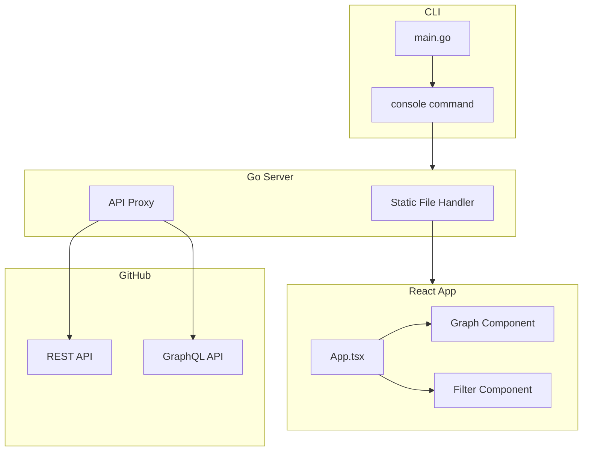
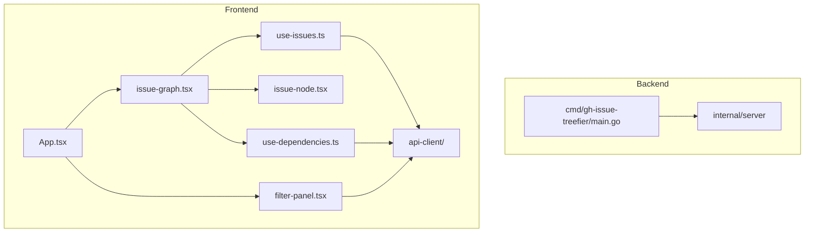
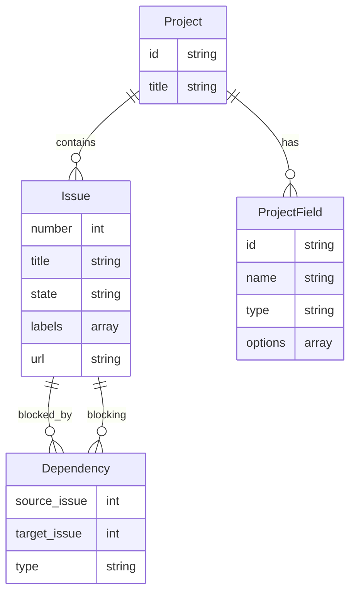

# Design Document

このドキュメントは `2026-02-06` に作成されました(`933132a`)。

## 概要

gh-issue-treefier MVP の設計ドキュメント。GitHub issue の依存関係を DAG として可視化する Web コンソール機能を実装する。

## ステアリングドキュメントとの整合性

### 技術選定 (tech.md)

- Go バックエンドで HTTP サーバーを起動し、React フロントエンドを embed で配信
- go-gh を使用して gh CLI の認証情報を再利用
- React Flow + Dagre でグラフ表示
- REST API と GraphQL API の両方をプロキシ

### プロジェクト構成 (structure.md)

- `cmd/gh-issue-treefier/` - CLI エントリーポイント
- `internal/server/` - HTTP サーバー（静的ファイル配信 + API プロキシ）
- `web/src/api-client/` - GitHub API クライアント
- `web/src/components/` - React コンポーネント
- `web/src/hooks/` - カスタムフック

## アーキテクチャ

### 設計パターンと原則

- **単一責任原則**: サーバーは配信とプロキシのみ、ロジックはフロントエンドに集約
- **コンポーネントの分離**: グラフ表示、フィルター、ノード詳細を独立したコンポーネントに
- **サービス層の分離**: API クライアントを hooks から分離

## コンポーネントとモジュール

### コンポーネントの依存関係

### cmd/gh-issue-treefier/main.go

- **目的:** CLI エントリーポイント。`console` サブコマンドを処理
- **依存関係:** internal/server

### internal/server

- **目的:** HTTP サーバー。静的ファイル配信と GitHub API プロキシ
- **依存関係:** go-gh（認証情報取得）

### web/src/api-client/

- **目的:** GitHub REST/GraphQL API へのリクエストを抽象化
- **依存関係:** なし

### web/src/components/issue-graph.tsx

- **目的:** React Flow を使用して issue の DAG を表示
- **依存関係:** React Flow, Dagre, use-issues, use-dependencies

### web/src/components/issue-node.tsx

- **目的:** グラフ上の個別ノード（issue）の表示
- **依存関係:** React Flow

### web/src/components/filter-panel.tsx

- **目的:** プロジェクト、フィールド、状態によるフィルタリング UI
- **依存関係:** api-client

### web/src/hooks/use-issues.ts

- **目的:** issue 一覧の取得と状態管理
- **依存関係:** api-client

### web/src/hooks/use-dependencies.ts

- **目的:** issue 依存関係の取得と状態管理
- **依存関係:** api-client

## データモデル

## エラーハンドリング

### エラーシナリオ

1. **GitHub API 認証エラー**
   - **ハンドリング:** 401 を返し、フロントエンドでエラーメッセージ表示
   - **ユーザーへの影響:** 「gh auth login を実行してください」と表示

2. **リポジトリが見つからない**
   - **ハンドリング:** 404 を返す
   - **ユーザーへの影響:** 「リポジトリが見つかりません」と表示

3. **API レート制限**
   - **ハンドリング:** 429 を返し、Retry-After ヘッダーを転送
   - **ユーザーへの影響:** 「API レート制限に達しました。しばらく待ってください」と表示

4. **ネットワークエラー**
   - **ハンドリング:** フロントエンドで fetch エラーをキャッチ
   - **ユーザーへの影響:** 「接続エラーが発生しました」と表示

## テスト戦略

### ユニットテスト

- **Go**: internal/server のプロキシロジック
- **React**: hooks のデータ変換ロジック、コンポーネントのレンダリング

### E2E テスト

- MVP ではスコープ外（将来的に Playwright で実装予定）
