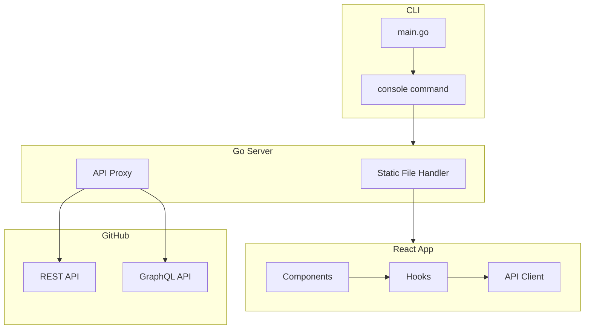
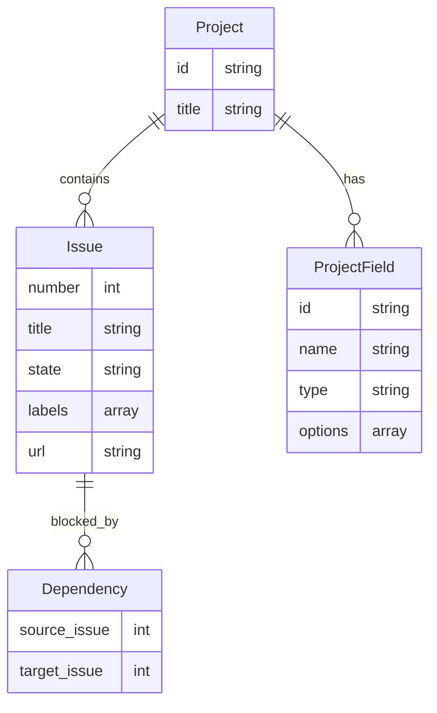

# Design Document

このドキュメントは `2026-02-06` に作成されました(`933132a`)。

## 概要

gh-issue-treefier MVP の設計ドキュメント。GitHub issue の依存関係を DAG として可視化する Web コンソール機能を実装する。

## ステアリングドキュメントとの整合性

### 技術選定 (tech.md)

- Go バックエンドで HTTP サーバーを起動し、React フロントエンドを embed で配信
- go-gh を使用して gh CLI の認証情報を再利用
- React Flow（@xyflow/react）+ Dagre でグラフ表示
- REST API と GraphQL API の両方をプロキシ

### プロジェクト構成 (structure.md)

- `cmd/gh-issue-treefier/` - CLI エントリーポイント
- `internal/server/` - HTTP サーバー
- `web/src/` - React アプリケーション

## アーキテクチャ

### 設計パターンと原則

- **単一責任原則**: サーバーは配信とプロキシのみ、ロジックはフロントエンドに集約
- **コンポーネントの分離**: 表示とデータ取得を分離
- **シンプルさ優先**: MVP では最小限の構成から始め、必要に応じて分割

### コンポーネント分割の方針

MVP では以下の方針で進める：

- **最初はシンプルに**: 1ファイルで完結できるものは分割しない
- **分割の判断は実装時に**: 実装を進める中で複雑になったら分割を検討
- **過度な抽象化を避ける**: 将来の拡張性より、今動くものを優先

例えば：
- カスタムノードは React Flow の標準機能で十分なら使わない
- hooks は1つで済むなら分割しない
- API クライアントも最小限の関数から始める

## コンポーネントとモジュール

### バックエンド

#### CLI (cmd/gh-issue-treefier)

- `console` サブコマンドを処理
- `--port` オプションでポート指定（未指定時は空きポート自動採番）
- サーバー起動後にブラウザを自動で開く

#### HTTP サーバー (internal/server)

- 静的ファイル配信（embed された React ビルド成果物）
- GitHub API プロキシ
  - `/api/github/rest/*` → REST API
  - `/api/github/graphql` → GraphQL API
- go-gh で認証情報を取得し、リクエストに付与

### フロントエンド

#### API クライアント層

- REST API と GraphQL API へのリクエストを抽象化
- エラーハンドリングの共通化

#### データ取得層（Hooks）

- Issue 一覧と依存関係の取得
- プロジェクト・フィールド情報の取得（GraphQL）
- フィルタ状態の管理

#### 表示層（Components）

- React Flow を使用した DAG 表示
- Dagre による自動レイアウト
- フィルタ UI（プロジェクト、フィールド、状態）
- ノード詳細表示

## データモデル

## エラーハンドリング

| シナリオ | ハンドリング | ユーザーへの影響 |
|---------|-------------|----------------|
| 認証エラー | 401 を返す | 「gh auth login を実行してください」 |
| リポジトリ不明 | 404 を返す | 「リポジトリが見つかりません」 |
| API レート制限 | 429 + Retry-After | 「レート制限に達しました」 |
| ネットワークエラー | fetch エラーをキャッチ | 「接続エラーが発生しました」 |

## テスト戦略

### ユニットテスト

- Go: プロキシロジック
- React: データ変換ロジック

### E2E テスト

- MVP ではスコープ外
