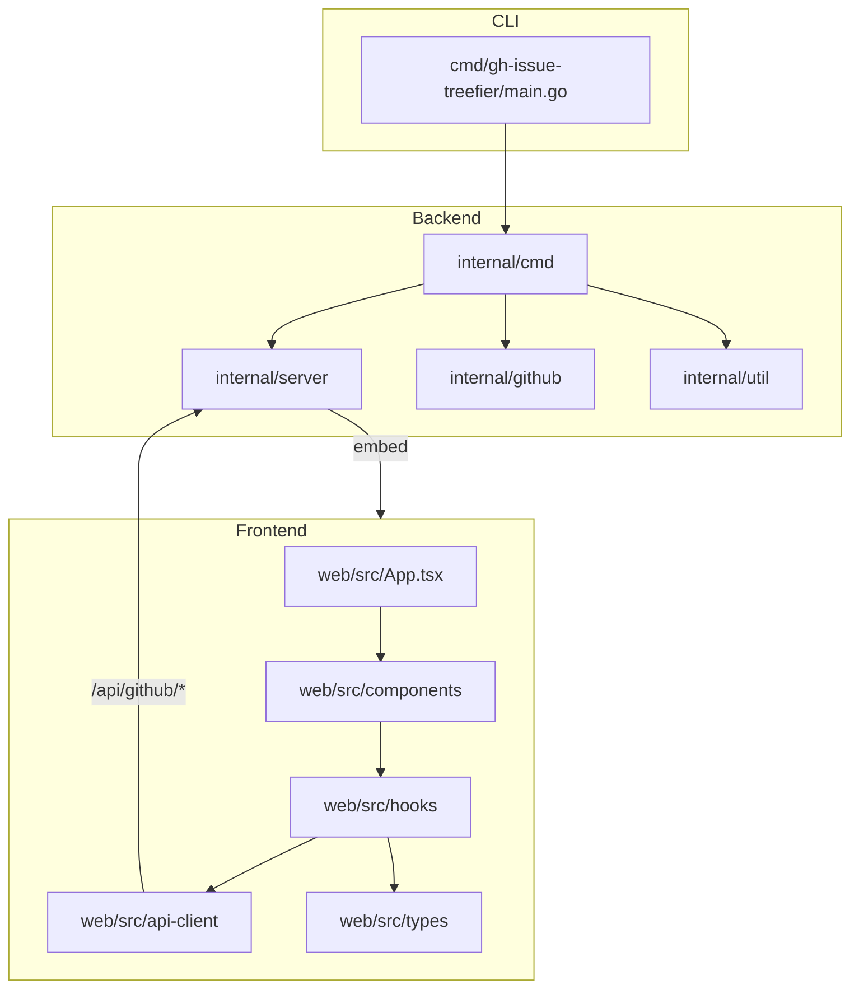

# プロジェクトの構造

このドキュメントは `2026-02-05` に作成されました(`no-commit`)。

## ディレクトリ構造

```
gh-issue-treefier/
├── cmd/                        # CLI エントリーポイント
│   └── gh-issue-treefier/
│       └── main.go
├── internal/                   # 非公開パッケージ
│   ├── cmd/                    # CLI コマンド定義 (root, console)
│   ├── github/                 # GitHub API ゲートウェイ (ProjectV2 取得等)
│   ├── server/                 # HTTP サーバー (静的ファイル配信 + GitHub API プロキシ)
│   │   └── dist/               # フロントエンドビルド成果物 (embed 対象, ビルド時にコピー)
│   └── util/                   # ユーティリティ (ブラウザ起動等)
├── web/                        # フロントエンド (React + TypeScript)
│   ├── .storybook/             # Storybook 設定
│   ├── public/                 # 静的アセット
│   ├── src/
│   │   ├── api-client/         # GitHub API クライアント (REST + GraphQL)
│   │   ├── components/         # React コンポーネント
│   │   ├── hooks/              # カスタムフック (issues, projects, mutations)
│   │   ├── types/              # TypeScript 型定義 (issue, project, github)
│   │   ├── App.tsx             # ルートコンポーネント
│   │   └── main.tsx            # エントリーポイント
│   ├── dist/                   # Vite ビルド出力
│   ├── package.json
│   └── vite.config.ts
├── .spec-workflow/             # 仕様駆動開発ドキュメント
│   ├── steering/               # ステアリングドキュメント
│   └── specs/                  # 仕様・設計・タスク
├── go.mod
├── go.sum
├── Makefile
└── AGENTS.md
```

## 設計原則

1. **単一責任**: 各モジュール/パッケージは単一の責任を持つ
2. **モジュール化**: Go は internal/ 配下でパッケージ分離、React は components/ でコンポーネント分離
3. **テスト容易性**: 外部依存（GitHub API）はインターフェースで抽象化
4. **一貫性**: Go は標準レイアウト、React は機能ベースの構成

## モジュール間の依存関係



## 命名規則

### ファイルとディレクトリ

- ファイル名 (Go): `snake_case.go`
- ファイル名 (TypeScript): `kebab-case.tsx` / `kebab-case.ts`
- ディレクトリ名 (Go): `snake_case`
- ディレクトリ名 (TypeScript): `kebab-case`
- テストファイル (Go): `*_test.go`
- テストファイル (TypeScript): `*.test.tsx`

### コード

- クラス/型名: `PascalCase`
- 関数/メソッド名 (Go): `PascalCase` (公開), `camelCase` (非公開)
- 関数/メソッド名 (React): `camelCase`
- 定数名: `PascalCase` (Go), `UPPER_SNAKE_CASE` (TypeScript)
- 変数名: `camelCase`

### インポート/依存関係の順序

- **Go**: goimports による自動整形
- **TypeScript**: Biome による自動整形

## コードサイズのガイドライン

- ファイルサイズ: 300行以下を目安
- 関数/メソッドサイズ: 50行以下を目安
- クラス/モジュールの複雑さ: 循環的複雑度 10 以下
- ネストの深さ: 3レベル以下を目安
