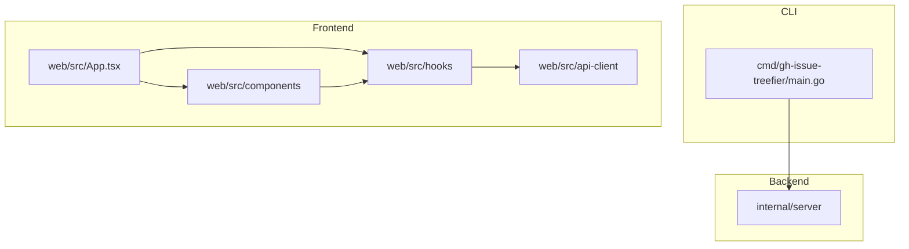

# プロジェクトの構造

このドキュメントは `2026-02-05` に作成されました(`no-commit`)。

## ディレクトリ構造

```
gh-issue-treefier/
├── cmd/                    # CLI エントリーポイント
│   └── gh-issue-treefier/
│       └── main.go
├── internal/               # 非公開パッケージ
│   └── server/             # HTTP サーバー (静的ファイル配信 + GitHub API プロキシ)
├── web/                    # フロントエンド (React)
│   ├── src/
│   │   ├── api-client/     # GitHub API クライアント
│   │   ├── components/     # React コンポーネント
│   │   ├── hooks/          # カスタムフック
│   │   ├── types/          # TypeScript 型定義
│   │   └── App.tsx
│   ├── package.json
│   └── vite.config.ts
├── dist/                   # フロントエンドビルド成果物 (embed 対象)
├── go.mod
├── go.sum
└── Makefile
```

## 設計原則

1. **単一責任**: 各モジュール/パッケージは単一の責任を持つ
2. **モジュール化**: Go は internal/ 配下でパッケージ分離、React は components/ でコンポーネント分離
3. **テスト容易性**: 外部依存（GitHub API）はインターフェースで抽象化
4. **一貫性**: Go は標準レイアウト、React は機能ベースの構成

## モジュール間の依存関係



## 命名規則

### ファイルとディレクトリ

- ファイル名 (Go): `snake_case.go`
- ファイル名 (TypeScript): `kebab-case.tsx` / `kebab-case.ts`
- ディレクトリ名 (Go): `snake_case`
- ディレクトリ名 (TypeScript): `kebab-case`
- テストファイル (Go): `*_test.go`
- テストファイル (TypeScript): `*.test.tsx`

### コード

- クラス/型名: `PascalCase`
- 関数/メソッド名 (Go): `PascalCase` (公開), `camelCase` (非公開)
- 関数/メソッド名 (React): `camelCase`
- 定数名: `PascalCase` (Go), `UPPER_SNAKE_CASE` (TypeScript)
- 変数名: `camelCase`

### インポート/依存関係の順序

- **Go**: goimports による自動整形
- **TypeScript**: Biome による自動整形

## コードサイズのガイドライン

- ファイルサイズ: 300行以下を目安
- 関数/メソッドサイズ: 50行以下を目安
- クラス/モジュールの複雑さ: 循環的複雑度 10 以下
- ネストの深さ: 3レベル以下を目安
