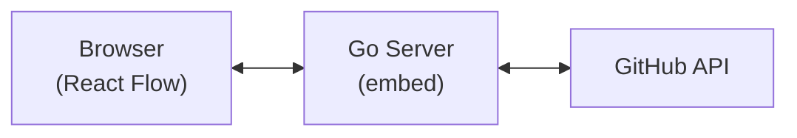

# 技術選定

このドキュメントは `2026-02-05` に作成されました(`no-commit`)。

## プロジェクトの概要

**種別**: CLI ツール（gh extension）+ ローカル Web サーバー

**アーキテクチャ**: クライアントサーバー型
- Go 製 CLI がローカル Web サーバーを起動
- ブラウザでReact製フロントエンドを表示
- フロントエンドから GitHub API を呼び出し（サーバー経由）

## コア技術

### 主な言語

- **バックエンド**: Go
  - ランタイム: Go 1.22+
  - パッケージマネージャー: Go Modules
- **フロントエンド**: TypeScript
  - ランタイム: Node.js (ビルド時のみ)
  - パッケージマネージャー: npm / pnpm

### 主要なライブラリやフレームワーク

**バックエンド (Go)**:
- **go-gh**: GitHub CLI extension SDK。`gh` コマンドの認証情報を再利用し、GitHub API へアクセス
- **embed**: フロントエンドのビルド成果物を Go バイナリに埋め込み、シングルバイナリで配布

**フロントエンド (React)**:
- **React**: UI フレームワーク
- **React Flow**: DAG（有向非巡回グラフ）の表示・編集ライブラリ。ノードのドラッグ、エッジの接続、ズーム/パン等を提供
- **Dagre**: グラフの自動レイアウトアルゴリズム。React Flow と組み合わせてノードを自動配置

### データストレージ

- **Primary storage**: なし（GitHub が真のデータソース）
- **Caching**: インメモリ（セッション中のみ）
- **Data formats**: JSON（GitHub API レスポンス）

### 外部連携

- **APIs**: GitHub REST API（issue dependencies）
- **Protocols**: HTTP/REST
- **Authentication**: `gh` CLI の認証情報を go-gh 経由で利用

## 技術的要件と制約

### パフォーマンス要件

- 100 issue のリポジトリで 2 秒以内にグラフ描画
- サーバー起動から 1 秒以内にブラウザで利用可能

### 互換性要件

- **プラットフォームサポート**: macOS, Linux, Windows（gh CLI が動作する環境）
- **依存関係**: gh CLI 2.0+ がインストールされていること
- **ブラウザ**: モダンブラウザ（Chrome, Firefox, Safari, Edge）

### セキュリティとコンプライアンス

- **認証**: gh CLI の既存認証を再利用（新規認証フロー不要）
- **データ保護**: ローカル実行のみ、外部サーバーへのデータ送信なし
- **スコープ**: repo スコープの権限が必要（issue dependencies API へのアクセス）

### スケーラビリティと信頼性

- **想定負荷**: 個人利用、同時接続 1
- **可用性要件**: ローカルツールのため N/A
- **成長予測**: N/A

## 既知の制限事項

- **API レート制限**: GitHub API のレート制限（認証済みで 5000 req/hour）に依存
- **大規模リポジトリ**: 1000+ issue のリポジトリではページネーション処理が必要
- **リアルタイム同期**: 他ユーザーの変更はリロードするまで反映されない
