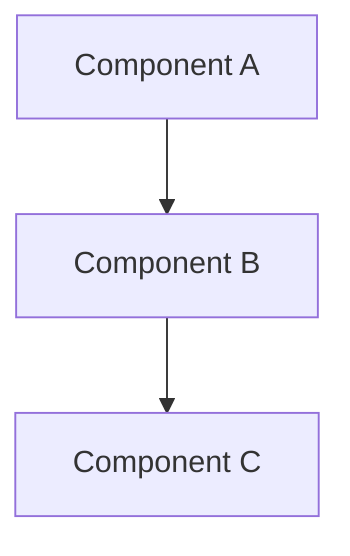
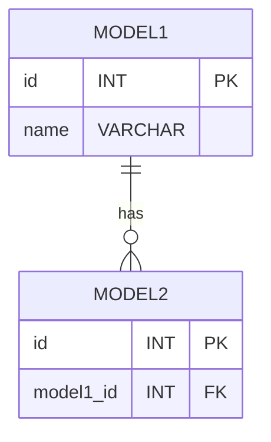
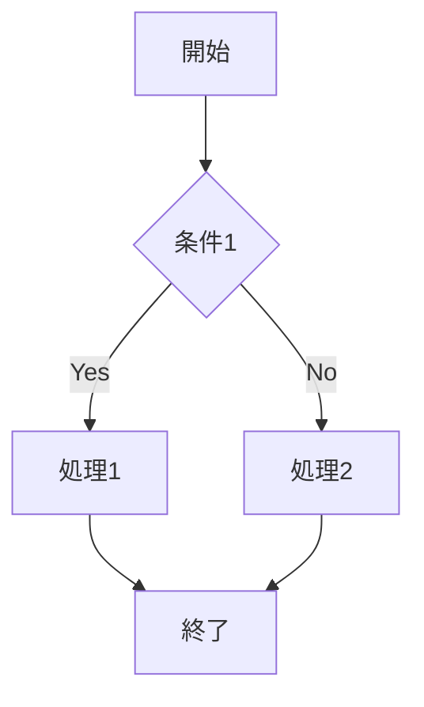

# Design Document

## Overview

このドキュメントは `{{date}}` に作成されました(`{{shortCommitHash}}`)。

## ステアリングドキュメントとの整合性

### tech.md との技術基準

[どのように設計が文書化された技術パターンと基準に従っているか]

### structure.md とのプロジェクト構成

[実装がプロジェクトの規約にどのように従うか]

## アーキテクチャ

[全体のアーキテクチャと使用される設計パターンを記述]

[主要なモジュール・コンポーネント・パッケージ等の依存関係を示す図]

### 設計原則

- **単一責任原則**: 各ファイルは一つの特定の関心事やドメインを扱うべきである
- **コンポーネントの分離**: 大きなモノリシックなファイルではなく、小さく焦点を絞ったコンポーネントを作成する
- **サービス層の分離**: データアクセス、ビジネスロジック、プレゼンテーション層を分離する
- **ユーティリティのモジュール化**: ユーティリティは焦点を絞った単一目的のモジュールに分割する

## データモデリング

[主要なデータモデルとその関係を説明。mermaidを使用して視覚化]

### モデル1

[モデルの説明を簡潔に記述]

### モデル2

[モデルの説明を簡潔に記述]

## エラーハンドリング

### エラーシナリオ

1. **[シナリオ1]:**
   - [ユーザーから見た場合の影響]
   - [どのようにハンドリングするか技術的な実装方針。不要であれば省略可]
2. **[シナリオ2]:**
   - [ユーザーから見た場合の影響]
   - [どのようにハンドリングするか技術的な実装方針。不要であれば省略可]

## テスト戦略

### ユニットテスト

- [ユニットテストの対象]
- [ユニットテストの主なケース]
- [使用するツールやフレームワーク]

### 結合テスト

- [結合テストの対象]
- [結合テストの主なケース]
- [使用するツールやフレームワーク]

### E2Eテスト

- [E2Eテストの主要なケース]
- [使用するツールやフレームワーク]

## 処理フロー

[主要な処理フローを説明。flowChartやsequenceDiagramを使用して視覚化。主要なフローが複数ある場合はそれぞれ見出しを切って記述]

## トレードオフと代替案(省略可)

[設計上の重要なトレードオフと考慮した代替案を説明]

## その他考慮事項 (省略可)

[将来の拡張や非機能要件に関する考慮事項があれば、見出しを切って記述]
